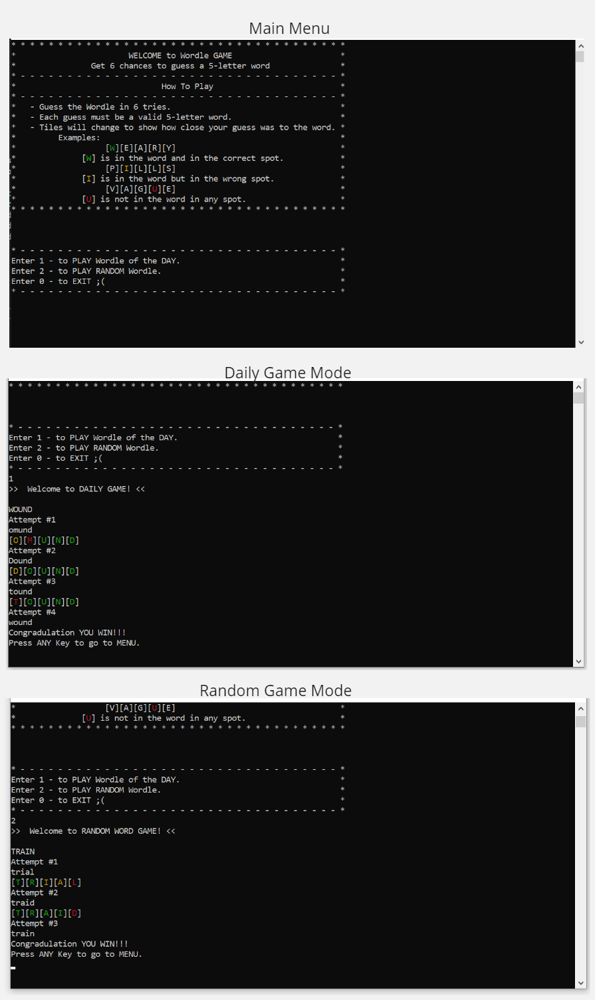
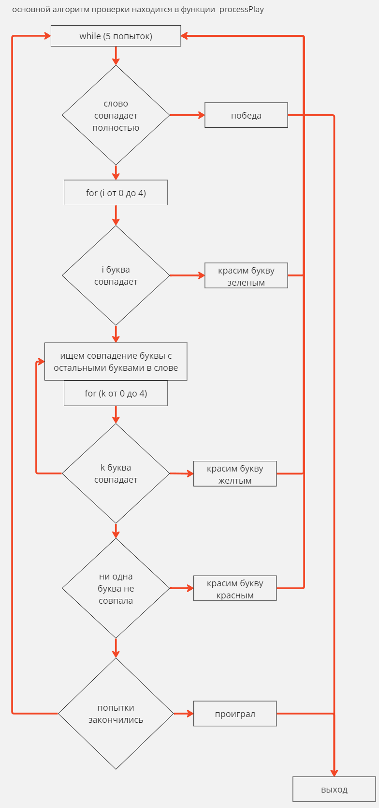

<h3>Project:</h3>
Mini game in console Wordle
 
<a href = "https://slovko.zaxid.net/">Reference #1 Web version UA</a>
 
<a href = "https://www.nytimes.com/games/wordle/index.html">Reference #2 Wordle Web version EN</a>
 
<h3>Screenshots:</h3>

 

 
<h3>Used vacabulary:</h3>

<a href = "https://copylists.com/words/list-of-5-letter-words">Small size vacabulary words.txt</a>
 
<a href = "https://github.com/charlesreid1/five-letter-words/blob/master/sgb-words.txt">Middle size vacabularyy sgb-words.txt</a>

